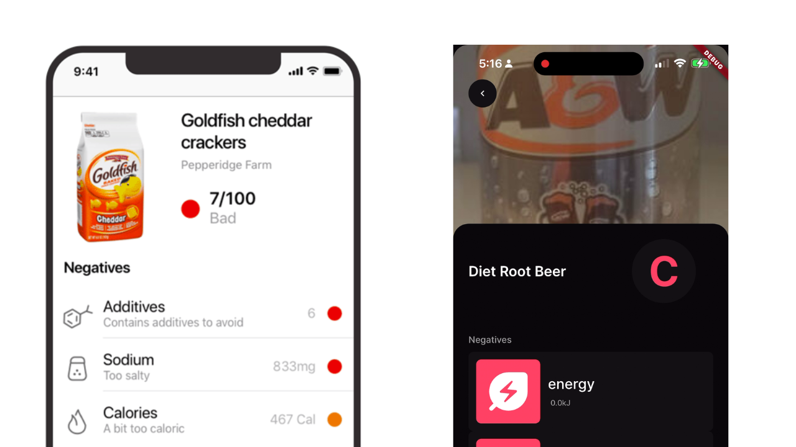
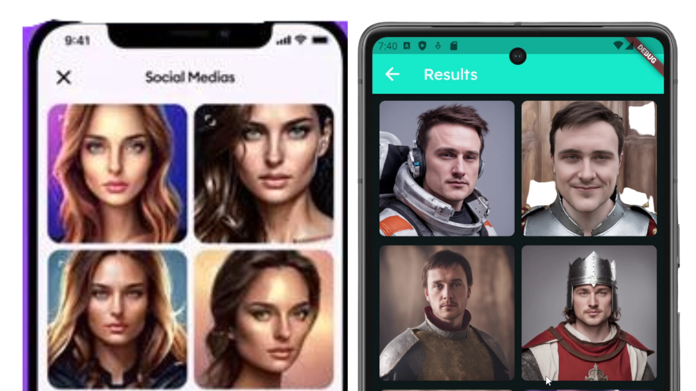
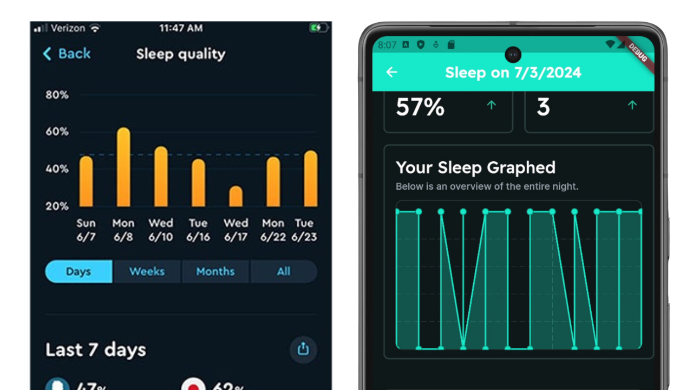

# 3 Popular App Recreations

### From my video on [YouTube]()

Made using [FlutterFlow](https://bit.ly/3Touttn)

## Recreated Apps 📱

1. Yuka / Lewka

2. AI Avatar Maker & Editor

3. Sleep Tracking Application

## Description

All apps can be run locally with Flutter using v3.19. Backend requires firebase.

The backend server is for all applications is one FastAPI server that can be run locally.

## Installation

1. Clone the repository
2. Change .env.example to .end and fill in the required fields (Make sure to import Firebase credentials JSON file)
    1. Ngrok is required for the backend to work with the Flutter app.
3. Run docker compose up to start the backend server.
4. Choose an app to run in the apps repository.

## Disclaimer

The apps created are for educational purposes only. If you run into issues, please submit a PR or issue.

